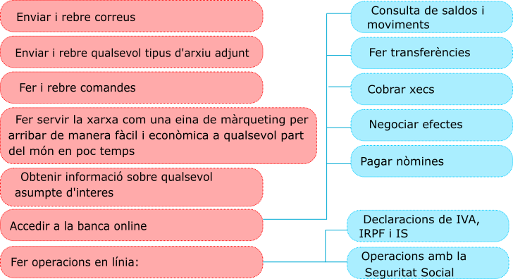

---
output:
  pdf_document: default
  html_document: default
---
# Comunicació i transmisió
La necessitat de comunicació és indubtable en qualsevol àmbit de la vida, i també en el treball, sobretot quan es treballa en equip.

**A. Transmissió de la informació interna de l'empresa**

És la que es produeix dins l'empresa mateixa. Una bona comunicació millora el clima laboral i ajuda a reconèixer possibles deficiències dins l'organització. Una bona xarxa de comunicació interna ajuda també a agilitzar la feina.

**B. Transmissió de la informació externa**

Per la seua importància, la comunicació de l'empresaamb l'entorn exterior meriex una atenció especial, principalment pel que fa a l'**atenció al client**, que pot arribar a ser un element promocional per augmentar les vendes tan poderós com la publicitat o els descomptes.

Aterure un client nou és més difícil i costós que mantenir-ne un. Per això, actualment les empreses tracten de fidelitzar els seus clients oferint-los un bon servei.

Els clients augmentaran de nombre si coneixem les seues necessitats i si les sabem satisfer. Aquestes necessitats canvien, per la qual cosa l'empresa ha d'adaptar els seus productes, serveis i processos a aquests canvis amb la participació de tots els seus departaments.

És important recordar que un client passa a ser com un corresponsal del nostre producte pea a altres possibles clients.

**C. Formes de comunicació  i transmissió externa**

**La comunicació oral**

De tots els mitjans orals de comunicació en l'empresa el m'es important és sens dubte el **telèfon**, per la freqüència amb què s'utilitza. Ens permet comunicar-nos amb l'exterior: clients, proveïdors, entitats bancàries, etc. És important que la persona que manté la conversa telefònica tinga un tracte cortès i adequat, que utilitze un llenguatge correcte i que mostre interès pel seu interlocutor.

A més, gràcies a la informàtica podem comptar amb la **videoconferència**, que és la comunicació a temps real entre dues o més persones que es troben en un espai físic diferent i que es comuniquen a través d'internet utilitzant àudio i també vídeo. Permet la comunicació sense necessitat de desplaçar-se.


<center>

---------------------------------------------------------
**IMPORTANT**

**Regles importants per a la persona que atén un client:**


1. Mostar atenció i empatia

2. Tenir una presentació adequada

3. Mostrar una atenció personal i amable

4. Tenir a la mà informació adequada

5. Tenir una expressió corporal i oral adequada
---------------------------------------------------------

</center>

**La comunicació escrita**

La correspondència comercial té un paper determinant en la comunicació d'una empresa: estableix una relació entre aquesta i els agents externs (clients, proveïdors, creditors, etcétera) i proporciona una determinada imatge de l'empresa.

La **carta comercial** és la manera de comuncació tradicional més important en una empresa, malgrat que actualment s'estan imposant amb força les formes de comuncació a través de xarxa (correu electrònic, adreces web o xarxes socials).

Per fer una redacció correcta d'una carta, s'ha de tenir en compte una sèrie de normes bàsiques:
 
 - Netedat i correcció.
 - Frases curtes, senzilles, ben redactades i sense faltes d'ortografia.
 - Tracte cortès.
 
A més, hi ha una sèrie de consells que seran determinants en l'efectivitat de la carta comercial:

<center>

------------------------------------------------------------
Si comencem en plural, s'ha de continuar així durant tota la carta.

Si responem una carta, s'ha de citar la data, la referència i l'assumpte.

La justificació completa dóna lloc a documents estèticament uniformes. El marge dret sense justificar proporciona domuments més vius i directes.

Fer servir el doble espai entre línies permet una lectura més fàcil.

Els pàragrafs curts conviden més a la lectura que els que són massa llargs.
-------------------------------------------------------------
 
</center>

**La comunicació a través d'internet**

Internet s'ha imposat amb força com a mitjà de comunicació a l'empresa. Per menuda que siga, es fan les tasques de gestió i comunicació a través d'un ordinador i la xarxa.

a. **El correu electronic** (e-mail). Serveix per enviar i rebre missatges de text, imatges i arxius complets. 

b. Les **pàgines web** també tenen utilitat comercial. A través d'aquestes podem obtenir gran quantitat d'informació, conèixer altres empreses i donar-nos a conèixer.

També és un mitjà de **publicitat** important perquè podem arribar a un gran nombre de persones i empreses en tot el món i a qualsevol hora. A més, podem trobar adreces, catàlegs de productes, preus, condicions de lliurament i de pagament, dades sobre el mercat, etc. També podem fer directament comandes de compra i rebre comandes de possibles clients.

```{r echo=FALSE, out.width='80%'}

```

c. **Altres formes d'ús de la xarxa:** encara que tenen un àmbit d'aplicació molt present en el terreny de les relacions personals, també poden resultar de molta ajuda en l'àmbit comercial. Les més importants són:

- Les **llistes de correu**: són bases de dades amb adreces de persones o empreses que tenen interessos comuns i que serveixen per enviar missatges, per intercanviar notícies o per organitzar grups de debat o negociació.

- Els **grups de notícies** o newsgroups: serveixen per col·locar o rebre missatges, notícies o informació de qualsevol tipus agrupada per temes d'interés. Així, una empresa pot estar al corrent de tota l'actualitat i les novetats que van sorgint sobre qualsevol assumpte que consideri interessant per al seu negoci.

- Les **xarxes socials**: són d'aparició més recent. Amb aquestes podem crear un grup d'empreses amb les quals mantenim relacions i utilitzar-les com a mitjà de comunicació. 

# Testing

```{r echo=FALSE, eval=knitr::is_latex_output()}
res=webshot::webshot('testQuiz.html', 'qui1.png')
knitr::include_graphics(res)
```


```{r, echo=FALSE}
htmltools::includeHTML("testQuiz.html")
```


