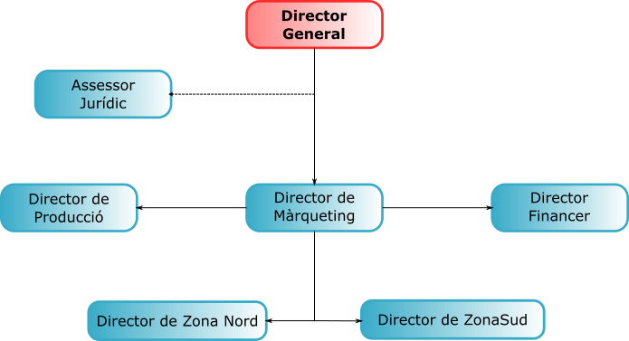
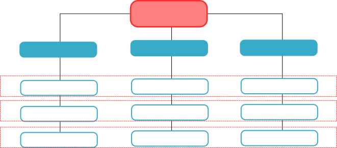

--- 
author: "Fernando Verdú Primo"
date: "`r Sys.Date()`"
site: bookdown::bookdown_site
title: # |
  # {height=842px style="display:block; margin:0 auto, align:center; pointer-events:none;"}
header-includes: 
- \AtBeginDocument{\renewcommand{\chaptername}{}}
- \setcounter{chapter}{1}
- \pagestyle{plain}
- \fancyhf{}
- \fancyfoot[R]{\thepage}
documentclass: book
classoption:
  - openany
bibliography:
- book.bib
- packages.bib
description: null
link-citations: yes
github-repo: nandoverdu/EAU_unitat2
papersize: a4
linestretch: 2
geometry:
  - top =1.5cm
  - bottom = 2.3cm
links-as-notes: true
---


# TEMA 2: Organització per departaments


L'organització, el treball en equip, la comunicació (tant interna com externa a l'empresa) i l'organització de la informació i arxiu són aspectes molt importants per a qualsevol empresa.


## 2.1 Conceptes bàsics 

### 2.1.1 Organització de l'empresa

L'**organigrama** és una representació de l'organització d'una empresa que reflecteix:

a. L'**estructura** de l'empresa amb els seus diferents departaments, seccions, divisions, etcétera.

b. L'**ordre jeràrquic** i l'establiment de les **relacions** entre els diferents graons que el configuren. L'ordre jeràrquic dóna lloc al nivell de responsabilitat.

c. Els **canals de comunicació**.

#### 2.1.1.1 Tipus d'organigrama

El que més s'utilitza és l'**organigrama funcional**. Es caracteritza per agrupar les activitats per departaments segons les funcions bàsiques de l'empresa.

```{r, echo=FALSE,fig.align='center',out.width="80%", fig.cap="Exemple d'organigrama funcional"}

```

\vspace{3cm}


```{r, echo=FALSE,fig.align='center',out.width="80%", fig.cap="Exemple d'organigrama matricial"}

```

**Recerca de informació sobre tipus d'organigrames, gràfiques, significat i exemples.**

#### 2.1.1.2 Avantatges i inconvenients  de la utilització d'organigrames

##### Avantatges

- Les tasques i funcions de cada treballador estan delimitades i definides amb claredat.
- Facilita i deixa clares les relacions entre els diferents òrgans de l'empresa, evitant malentesos i conflictes.
- Treu a la llum defectes que hi ha en diferents àmbits de l'empresa.
- Ajuda a l'orientació i a la integració dels nous admesos.
- Permet programar amb claredat les línies de promoció de les persones de l'empresa.
- Proporciona a les persones alienes a l'empresa una visió clara i ràpida de l'estructura organitzativa.

##### Inconvenients

- Simplifica la complexa realitat de les relacions que es donen entre els diferents llocs.
- Té en compte, gairebé exclusivament, relacions jeràrquiques.
- No té cura de les relacions funcionals.
- Reprodueix l'estructura en el moment de la seua elaboració, per la qual cosa a vegades no correspon amb la realitat.
- Suposa un cost considerable.
- S'ha d'actualitzar constantment.

### 2.1.2 Qué és el treball en equip?

El **treball en equip** implica un grup de persones traballant de manera coordinada en l'execució d'un projecte. El resultat final és responsabilitat de l'equip, però no de cadascun dels seus membres de manera independent.

Cada membre de l'equip és responsable d'una tasca i només si tots compleixen la seua funció serà possible tirar endavant el projecte.

El treball en equip no és només la suma de les aportacions individuals. Un grup de persones que treballen juntes però sense cap coordinació, en el qual cada un fa la seua feina de manera individual sense comptar amb els altres, no forma un equip.Per exemple:

a. Un grup de mecànics d'un taller, en el qual cadascun és responsable dels cotxes que repara, no forma un equip.

b. Un grup de professionals mèdics en una sala d'operacions (cirurgià, anestesista, infermera i especialista cardiovascular) sí que formen un equip. Tots treballen junts, cadascun en la seva especialitat, i el treball de tots junts és fonamental per tal que l'operació tinga èxit, per la qual cosa han d'estar coordinats.
